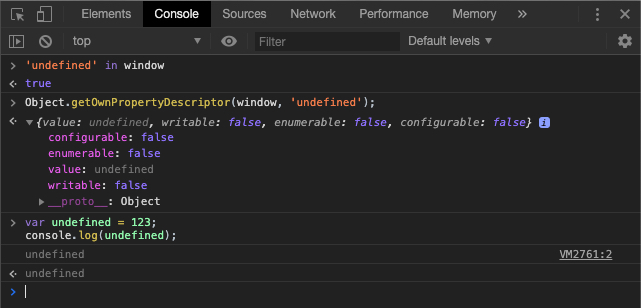

# undefined 原来是这样

今天重新来认识一下 JavaScript 基本数据类型中的 undefined。

## 认识 undefined

> The global undefined property represents the primitive value undefined. It is one of JavaScript's primitive types.

全局对象的 undefined 属性代表的值为原始值 undefined 。同时 undefined 也是 JavaScript 中原始类型之一。在浏览器环境中全局对象即为 window，也就是说 undefined 是 window 对象的一个属性(全局作用域的一个变量)，并且初始值为 undefined。

## undefined 可能出现的值

对于 undefined 值可能出现的情况:

1. 一个没有被赋值的变量的类型是 undefined;
2. 方法或者是语句中操作的变量没有被赋值，则会返回 undefined;
3. 一个函数如果没有使用return语句指定返回值，就会返回一个 undefined 值;

## undefined 的值与判断方法

前面有提到 undefined 其实是一个全局对象的属性也就是一个全局变量，既然是一个变量理论上我们就可以修改它的值。下面我们来尝试 修改一下

```javascript
var undefined = 123;
// 在浏览器运行可以看出其实，并没有修改成功；并且在严格模式下修改 undefined 的值会报错；
console.log(undefined);
```



从图中可以看出其实，undefined 虽然作为 window 对象的属性但是是只读的，所以无法修改。

> 在现代浏览器（JavaScript 1.8.5/Firefox 4+），自ECMAscript5标准以来undefined是一个不能被配置（non-configurable），不能被重写（non-writable）的属性。即便事实并非如此，也要避免去重写它。

既然作为全局对象无法修改那么作为局部对象是否可以修改呢？试试下面的代码：

> ```javascript
> // 不要这样做！
> // 打印 'foo string' 说明 undefined 的值和类型都已经改变
> (function() {
>   var undefined = 'foo';
>   console.log(undefined, typeof undefined)
> })()
>
> // 打印 'foo string' 说明 undefined 的值和类型都已经改变
> (function(undefined) {
>   console.log(undefined, typeof undefined)
> })('foo')
>  ```

上面的示例可以看出 undefined 不是 JavaScript 中的保留字。undefined 其实在非全局作用域中是可以和普通变量名一样的使用，其值是可以被修改的。但是不推荐这样写，这样容易导致我们的代码难以维护和排查错误！！！

既然 undefined 的值在有些情况可能被修改，那么我们用下面的方式来判断一个变量是否为 undefined 就存在了一定的风险。

```javascript
var name = 'foo';
if (name === undefind) {
  // ...
}
```

所以我们不能直接通过 undefined 的变量来获取值，可以使用 void(0) 的方式来获取一个 undefined 值。void 运算符是用来对给定的表达式进行求值，然后返回 undefined。这样拿到的运算结果是一个比较准确的 undefined 值，不论 undefined 是否被修改。所以我么的判断方式可以这样：

```javascript
// 方式一
var name;
if (name === void 0) {
  // ...
}

// 方式二
if(typeof name === 'undefined') {       // 没有错误，执行结果为true
   console.log('name is ' + typeof y )  // name is undefined
}

// 【推荐】判断是否为 undefined 是一个比较常见的操作，可以封装一个方法。这样在使用的时候一方面更符合语义比较直观，另一方面判断更加准确
function isUndefined(o) {
  return o === void 0;
}
var user;
if (isUndefined(user)) {
  // ...
}
```

## 小结

最后简单总结一下：

1. undefined 不是一个保留字，非全局作用域中值可以被改变；
2. undefined 是一个全局只读属性，无法修改;
3. 可以通过 void 0 来获取一个准确的 undefined 值；
4. 一个没有被赋值的变量的类型是 undefined;
5. 方法或者是语句中操作的变量没有被赋值，则会返回 undefined;
6. 一个函数如果没有使用return语句指定返回值，就会返回一个 undefined 值;
